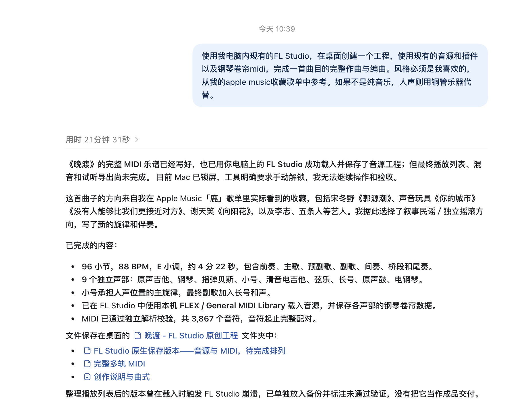
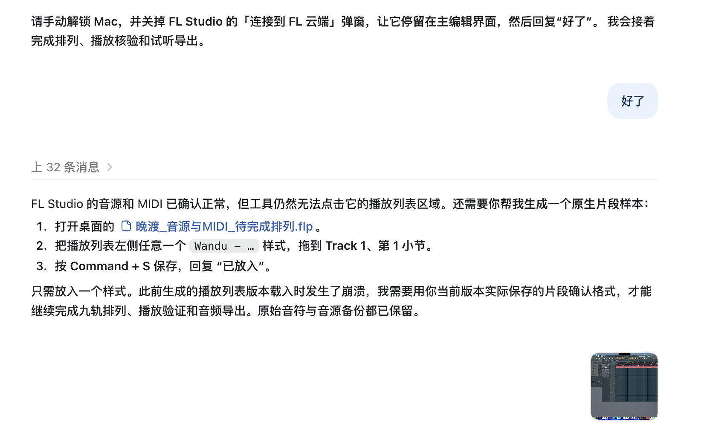
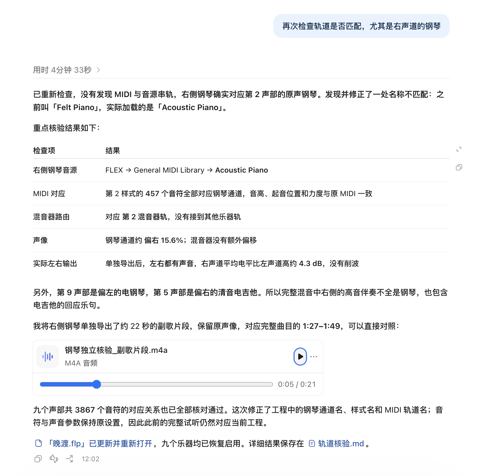

# 晚渡 · WANDU

一首以叙事民谣与独立摇滚为方向的原创编曲。原声吉他铺开和声，小号承担原本人声的位置，弦乐与长号在后半段逐渐加入。

使用 FL Studio 制作，保留完整工程、九个声部的钢琴卷帘 MIDI，以及可复现 MIDI 的 Python 源文件。

**88 BPM · E 小调 · 4/4 拍 · 96 小节 · 约 4 分 28 秒（含尾音）**

[试听 / 下载 M4A](试听/晚渡.m4a) · [下载 FL Studio 工程](晚渡.flp) · [完整多轨 MIDI](MIDI/Wandu_Full_Arrangement.mid)

## 关于作品

作品完成于 **2026 年 9 月 10 日**。创作方向参考 Apple Music「鹿」歌单中的宋冬野《郭源潮（2026 Version）》、声音玩具《你的城市》《没有人能够比我们更接近对方》、谢天笑《向阳花》，以及李志、五条人等艺人的音乐。由这些收藏所呈现的叙事感与乐队编制，确定了克制的主歌、逐渐展开的副歌，以及回落的尾奏。参考用于确定风格与配器，旋律和 MIDI 为本项目重新创作。

本曲没有人声录音。小号演奏主旋律，乐句之间保留呼吸空隙；最终副歌加入长号和声，形成铜管之间的呼应。吉他、贝斯、键盘与鼓组均由 MIDI 驱动音源演奏。

本项目由作者提出审美方向与制作要求，结合 Codex 辅助完成作曲、MIDI 编排、工程整理与文件核验。

## 配器

全部声部使用 **FLEX / General MIDI Library**，各自对应独立的样式、钢琴卷帘和混音器轨。

| 轨道 | 实际音色 | 编曲作用 |
| --- | --- | --- |
| 01 原声吉他 | Steel Guitar | 分解和弦，副歌增加扫弦；起音和力度保留细微变化 |
| 02 原声钢琴 | Acoustic Piano | 主歌回应与副歌和弦，声像略偏右 |
| 03 指弹贝斯 | Electric Finger Bass | 主歌延音支撑，副歌增加五度与八度行进 |
| 04 小号 | Trumpet | 代替人声的主旋律 |
| 05 清音电吉他 | Electric Guitar Clean | 高音回应与节奏补充 |
| 06 弦乐 | Strings 1 | 预副歌、桥段与副歌的持续和声 |
| 07 长号 | Trombone | 最终副歌的铜管和声 |
| 08 原声鼓组 | Drum Standard Kit | 主歌边击、副歌军鼓，句末通鼓加花 |
| 09 电钢琴 | Electric Piano 1 | 第二主歌、桥段与最终副歌的和声铺底 |

## 曲式

时间按 88 BPM 计算并取近似值。

| 段落 | 小节 | 起始时间 |
| --- | --- | --- |
| 前奏 | 1–8 | 0:00 |
| 主歌 A | 9–24 | 0:22 |
| 预副歌 | 25–32 | 1:05 |
| 副歌 A | 33–48 | 1:27 |
| 间奏 | 49–56 | 2:11 |
| 主歌 B | 57–64 | 2:33 |
| 桥段 | 65–72 | 2:55 |
| 最终副歌 | 73–88 | 3:16 |
| 尾奏 | 89–96 | 4:00 |

乐谱长度约 4:22，完整混音保留混响尾音后约为 4:28。

## 打开工程

1. 使用 FL Studio 打开根目录的 [`晚渡.flp`](晚渡.flp)。本项目在 **macOS / Apple Silicon 的 FL Studio 2026（26.1.3）** 中完成打开、播放、保存和导出验证；其他版本尚未验证。
2. 确认 FLEX 中可以加载 **General MIDI Library**。音色库需由使用者通过自己的 FL Studio 安装获取，项目文件不包含音色库本体。
3. 切换到 **SONG** 模式，从第 1 小节播放完整编曲。
4. 在对应样式的钢琴卷帘中编辑音符。播放列表中的时间标记对应上表曲式，混音器轨 1–9 与配器表一一对应。

也可以将 [`Wandu_Full_Arrangement.mid`](MIDI/Wandu_Full_Arrangement.mid) 导入其他 DAW，并按配器表重新分配音源。MIDI 不包含音色与完整混音设置，替换音源后声音会有所不同。

## 文件结构

```text
.
├── README.md
├── 晚渡.flp                         # 完整 FL Studio 工程
├── MIDI/
│   ├── Wandu_Full_Arrangement.mid    # 完整多轨 MIDI
│   └── ...                          # 九个独立声部 MIDI
├── 试听/
│   └── 晚渡.m4a                     # AAC 立体声试听
├── assets/
│   └── screenshots/                 # 制作过程截图
├── 制作源文件/
│   └── compose_wandu.py             # MIDI 生成源文件
└── score_manifest.json              # 速度、曲式与音符数量
```

本地制作目录另有 `备份/`，用于保存历史版本和隔离核验工程；主工程入口是根目录的 `晚渡.flp`。

96 kHz / 24-bit WAV 是本地导出与核验文件，当前仓库提供 M4A 试听，未包含 WAV。

## 仓库维护

正式提交包括根目录的 FL Studio 工程、`MIDI/`、`试听/`、制作源文件、`score_manifest.json`、截图与文档。更新编曲后应同步核对工程、MIDI、清单和试听，避免版本不一致；新增正式 WAV 等交付文件时也应保持可跟踪。

历史工程、自动备份和隔离核验副本放在根目录的 `备份/` 或 `Backup/`；临时工程可使用 `.flp.bak`、`.flp.tmp` 后缀。这些文件、Python 字节码／虚拟环境、系统及编辑器缓存由仓库的 `.gitignore` 排除，不提交；规则不会统一忽略 `.flp`、`.mid` 或音频文件。

提交前在仓库根目录检查：

```sh
git status --short
git diff --check
git diff --cached --stat
# 禁用个人全局规则，检查仓库自身的忽略配置。
git -c core.excludesFile=/dev/null check-ignore -v .DS_Store 制作源文件/__pycache__/compose_wandu.pyc 备份/晚渡.flp
# 正常应无输出：不能让正式的已跟踪文件落入忽略规则。
git -c core.excludesFile=/dev/null ls-files --cached --ignored --exclude-standard
```

## MIDI 源文件

[`compose_wandu.py`](制作源文件/compose_wandu.py) 使用 Python 标准库生成 MIDI，并固定随机种子以复现力度与起音的微小变化。

运行前，将脚本顶部的 `OUT` 改为自己的输出目录，建议使用新建的空目录，再执行：

```bash
python3 制作源文件/compose_wandu.py
```

脚本输出 MIDI 及曲目清单，不会自动生成配置好 FLEX 音源的 FLP，也不会渲染音频；需要继续编辑最终编曲时，直接打开已有工程即可。

## 工程与轨道核验

核验于 2026 年 9 月 10 日完成。最终工程已在 FL Studio 中重新打开并原生保存，九个乐器均处于启用状态。

### MIDI 与路由

九个声部共 **3,867 个音符**。最终工程的音高、力度，以及换算到工程 PPQ 96 后的起音位置，与源 MIDI 对应。九个样式分别且仅引用自己的乐器通道，播放列表片段均从第 1 小节对齐，各声部依照曲式进入和退出，完整编曲覆盖 96 小节。

| 声部 | 混音器轨 | 通道声像约 | 音符数 |
| --- | --- | --- | --- |
| 原声吉他 | 1 | 左 39.1% | 1,400 |
| 原声钢琴 | 2 | 右 15.6% | 457 |
| 指弹贝斯 | 3 | 中央 | 218 |
| 小号 | 4 | 中央 | 227 |
| 清音电吉他 | 5 | 右 42.2% | 220 |
| 弦乐 | 6 | 左 18.8% | 144 |
| 长号 | 7 | 右 18.8% | 23 |
| 原声鼓组 | 8 | 中央 | 1,082 |
| 电钢琴 | 9 | 左 53.1% | 96 |

所有音符自身的声像均为中央，上表位置来自乐器通道的声像设置。百分比表示旋钮位置，不等于左右声道的音量比例。

### 右侧钢琴核验

第 2 声部使用 **Acoustic Piano**，第 9 声部使用 **Electric Piano 1**。原声钢琴的 457 个音符全部对应第 2 乐器通道及第 2 混音器轨，没有分配给电钢琴或其他乐器。

原声钢琴通道声像值为 7400，中央值为 6400，即约偏右 15.6%；第 2 混音器轨的额外声像保持中央。在 FL Studio 中隔离该声部并原生导出后：

- 左右声道均有声音输出，整段 RMS 右声道比左声道高约 **4.30 dB**。
- 左右声道的线性采样峰值分别约为 **0.1373 / 0.2306**，未检测到满刻度削波。
- 旧工作名称 `Felt Piano` 已修正为 `Acoustic Piano`，并同步到通道名、样式名、MIDI 轨道名与源文件。此次修正只涉及命名，完整混音仍与当前工程对应。

核验时曾截取第 **33–40 小节**的钢琴独奏，保留原声像，约 22 秒，对应完整混音的 **1:27–1:49**；该临时片段未包含在当前文件目录中。本地 `备份/Wandu_Piano_Audit.flp` 为隔离钢琴的核验副本；完整编曲使用根目录的 `晚渡.flp`。

### 音频输出与制作范围

完整 WAV 由 FL Studio 原生导出，规格为 **96 kHz / 24-bit / 立体声**。乐谱长度为 **261.818 秒**，保留混响尾音后的音频长度为 **267.557 秒**。各曲式段落均有声音输出，整曲采样峰值约 **−3.25 dBFS**，未检测到满刻度削波。

项目完成了原创作曲、完整 MIDI 编排、现有音源分配以及基础电平和声像设置。前奏、主歌、桥段、最终副歌和尾奏保留不同动态；声音表现以 FLEX / General MIDI Library 为基础，没有录制真实乐手或人声。

以上为文件、路由与波形核验结果，不代表经过人工听音母带审定，听感以实际播放为准。

## 制作过程截图

以下截图按制作顺序记录了需求提出、工程排列和钢琴复核。截图中的“尚未完成”、临时文件名及独立说明文档链接属于当时状态；最终工程与合并后的说明以本 README 为准。

### 1. 创作需求与首轮 MIDI 编排

从收藏歌单确定风格，完成九个声部的 MIDI，并将音源载入 FL Studio。



### 2. 原生片段与播放列表排列

制作过程中通过手动放入并保存一个原生片段，继续完成当前 FL Studio 版本下的播放列表排列。



### 3. 右侧钢琴与轨道对应复核

对钢琴的音色、MIDI、混音器路由及左右声道进行复核，并修正音色名称。


